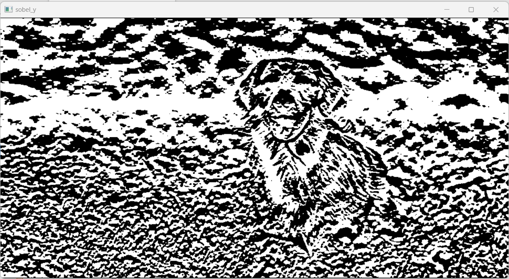

# EDGE-DETECTION
## Aim:
To perform edge detection using Sobel, Laplacian, and Canny edge detectors.

## Software Required:
Anaconda - Python 3.7

## Algorithm:
### Step1:
Import all the necessary modules for the program.

### Step2:
Load a image using imread() from cv2 module.

### Step3:
Convert the image to grayscale

### Step4:
Using Sobel operator from cv2,detect the edges of the image.

### Step5:

Using Laplacian operator from cv2,detect the edges of the image and Using Canny operator from cv2,detect the edges of the image.
### Program :
```
SOWMIYA N
212221230106
```
#### Read the image
```
import cv2
image=cv2.imread('dog.png',1)
cv2.imshow('Original Image',image)
cv2.waitKey(0)
cv2.destroyAllWindows()
```
#### Convert the image to grayscale
```
gray=cv2.cvtColor(image,cv2.COLOR_BGR2GRAY)
cv2.imshow("Gray scale Image",gray)
cv2.waitKey(0)
cv2.destroyAllWindows()
```
#### Blur the image :
```

img = cv2.GaussianBlur(gray,(3,3),0)
cv2.imshow("Blurred Image",img)
cv2.waitKey(0)
cv2.destroyAllWindows()

```
#### Sobel Edge Detector
```
sobel_x=cv2.Sobel(img,cv2.CV_64F,1,0,ksize=5)
cv2.imshow('sobel_x',sobel_x)
cv2.waitKey(0)
cv2.destroyAllWindows()
sobel_y=cv2.Sobel(img,cv2.CV_64F,0,1,ksize=5)
cv2.imshow('sobel_y',sobel_y)
cv2.waitKey(0)
cv2.destroyAllWindows()
sobel_xy=cv2.Sobel(img,cv2.CV_64F,1,1,ksize=5)
cv2.imshow('sobel_xy',sobel_xy)
cv2.waitKey(0)
cv2.destroyAllWindows()
```
#### Laplacian Edge Detector

```
rgb_image = cv2.cvtColor(image,cv2.COLOR_BGR2RGB)
laplacian_operator = cv2.Laplacian(rgb_image,cv2.CV_64F)
cv2.imshow('laplacian_operator',laplacian_operator)
cv2.waitKey(0)
cv2.destroyAllWindows()
```
#### Canny Edge Detector

```
canny_edges = cv2.Canny(img, 120, 150)
cv2.imshow('canny',canny_edges)
cv2.waitKey(0)
cv2.destroyAllWindows()
```
## Output:
### SOBEL EDGE DETECTOR
#### X-Axis :

#### Y-Axis :

#### XY-Axis :


### LAPLACIAN EDGE DETECTOR


### CANNY EDGE DETECTOR

## Result:
Thus the edges are detected using Sobel, Laplacian, and Canny edge detectors.